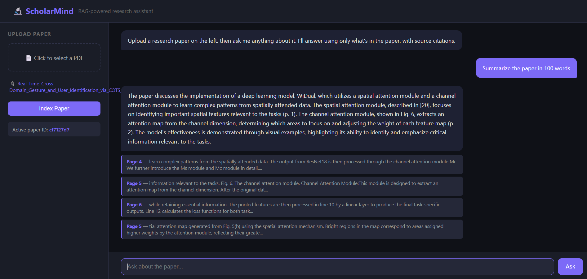

# 🔬 ScholarMind

A retrieval-augmented generation (RAG) pipeline for academic research papers.
Upload any PDF, ask questions, and get context-grounded answers with page-level citations.

## Tech Stack
- **Backend:** FastAPI, LangChain, FAISS
- **LLM:** Groq API (llama-3.1-8b-instant)
- **Embeddings:** HuggingFace sentence-transformers (all-MiniLM-L6-v2) — runs locally
- **Frontend:** Flask + vanilla JS
- **Storage:** SQLite (conversation history)

## Setup

```bash
git clone https://github.com/buvana-seshathri/scholarmind
cd scholarmind
python -m venv venv
source venv/bin/activate  # Windows: venv\Scripts\activate
pip install -r requirements.txt
```

Create a `.env` file in the project root:
```
GROQ_API_KEY=your_groq_key_here
```

## Run

Terminal 1 — Backend:
```bash
cd backend
uvicorn main:app --reload --port 8000
```

Terminal 2 — Frontend:
```bash
cd frontend
python app.py
```

Open `http://localhost:5000`

## Features
- PDF ingestion with LangChain chunking
- Local embeddings (no API cost, no quota limits)
- Semantic vector search via FAISS
- Source citations with page numbers per answer
- Conversation history persisted in SQLite per paper

